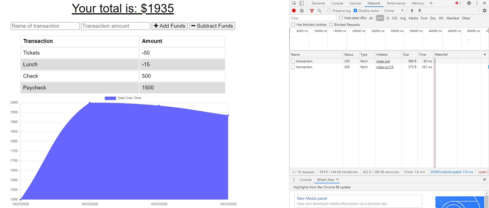

# Online/Offline Budget Tracker

## Table of Contents
- [Description](#descriptiongo)
- [Installation Instructions](#installgo)
- [Usage](#usagego)
- [Authors](#authorgo)
- [Deployed Links](#deployedgo)
- [Questions](#contactgo)
        
## Description

Giving users a fast and easy way to track their money is important, but allowing them to access that information anytime is even more important. Having offline functionality is paramount to our applications success.

## Installation Instructions

compression, express, lite-server, mongoose, morgan
## Usage

The user will be able to add expenses and deposits to their budget with or without a connection. When entering transactions offline, they should populate the total when brought back online.
## License

MIT License

## Authors

Shawn A. Rather

## Deployed

https://pure-dusk-54857.herokuapp.com/
## Questions

Refer to github or send email with any questions:

SAR-SA

sarsa.web@gmail.com
